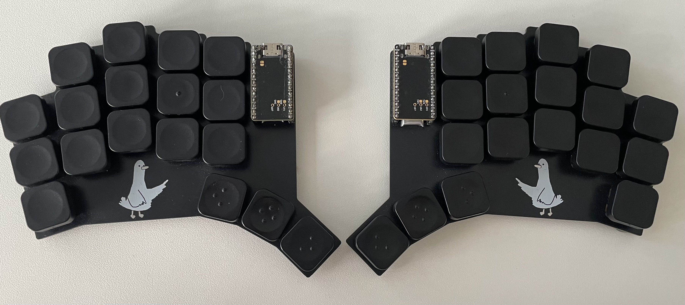

# Goos 🪿

**A minimalist, diodeless 36-key split keyboard.**

Inspired by [rae-dux](https://github.com/andrewjrae/rae-dux), itself an interpretation of the [A. Dux by Tapi](https://github.com/tapioki/cephalopoda/tree/main/Architeuthis%20dux), dressed in a black-and-white aesthetic and graced with a goos by [Patrick &lt;3](https://www.github.com/pgorner).

> [!WARNING]
> **The PCB files are mid-fix please don't fab the boards yet.** The firmware and keymap are fine; only the PCB / gerber files need work. (Remove this note once they're sorted.)

## What is Goos?

Goos is a wireless, battery-powered split keyboard with 36 keys, no screen, no underglow.

## Design philosophy: simple to build & minimalistic design

Every component you *don't* add is one you never have to wire up, flash, configure, or debug. 

**No diode matrix.** Most keyboards wire their switches into a grid of rows and columns with a diode at every switch, so the controller can tell overlapping presses apart. Goos skips the whole scheme. Each half has only 18 keys, and the nice!nano has enough free pins to give every switch its own GPIO. ZMK reads them directly (`zmk,kscan-gpio-direct`), so there are no diodes on the board and the firmware's scan definition is just a flat list of pins.

**No screen, no lights.** An OLED and RGB look great in photos and cost you battery life, solder joints, firmware config, and a longer list of things that can fail. Goos goes without, on purpose. The payoff is a board that's genuinely transportable, sips power, and very nearly configures itself.

## Why Colemak-DH?

Goos runs **Colemak-DH** by default, and that's as much a brain hack as an ergonomics one.

I switch between Goos and ordinary laptop/desktop keyboards all the time. When I tried to run one layout everywhere, my muscle memory bled across: a staggered QWERTY laptop and a column-staggered split feel nothing alike under the fingers, and my hands kept reaching for the wrong board's habits. Giving each board its own layout fixed it. **Split keyboard → Colemak. Normal keyboard → QWERTY.** The two are different enough that my hands flip context the instant they touch the keys, instead of fighting over one shared map.

A QWERTY layer is still present in the keymap. Toggle it with the **top-left + bottom-left** combo.

## Features

- 36 keys, column-staggered split
- Wireless (Bluetooth) and battery powered
- Diodeless direct GPIO scanning, no matrix
- No OLED, no LEDs ultra low-profile and transportable
- Mounting holes (some gerbers with, some without)
- Colemak-DH default with a QWERTY toggle layer
- A goos

## Building & flashing

No local toolchain needed, GitHub Actions builds the firmware for you.

1. **Fork this repo** to your own GitHub account.
2. Every push triggers a build. Open the **Actions** tab and wait for the run to go green.
3. Open the finished run and download the firmware artifact. You'll get a `.uf2` for each half (`goos_left`, `goos_right`) plus a `settings_reset` image.
4. Plug in one half and **double-tap its reset button** to enter the bootloader, it mounts as a USB drive named `NICENANO`.
5. **Drag the matching `.uf2` onto the drive.** It flashes and reboots on its own.
6. Repeat for the other half.

**Pairing the halves / connection trouble:** flash `settings_reset` to *both* halves first (same drag-and-drop), then flash the real `goos_left` / `goos_right` firmware. That wipes stale Bluetooth bonds so the halves rediscover each other cleanly.

## Customizing the keymap (no code required)

Goos ships with a layout file so you can edit the whole keymap visually in your browser, no device tree, no local build.

1. **Fork this repo** (if you haven't already).
2. Open the **[Keymap Editor](https://nickcoutsos.github.io/keymap-editor/)**.
3. **Authorize it with GitHub** so it can read your fork and commit changes back.
4. Pick your forked **goos** repo from the list.
5. The editor reads `config/goos.keymap` together with the physical layout in `config/goos.json`, so you see Goos's real shape on screen, including the thumb cluster, instead of a generic grid.
6. Click any key to rebind it, switch between layers with the layer tabs, and edit combos and behaviors right there.
7. **Save.** The editor commits straight to your fork, which kicks off a fresh GitHub Actions build automatically. When it's green, grab the new firmware from the run (step 3 above) and flash it.

> [!NOTE]
> The `config/goos.json` layout file is what lets the editor render Goos correctly. If you move or rename it, the editor falls back to a plain grid, keep it where it is.

## Layers

Goos reaches its layers through holds and combos: **hold** a thumb key for a momentary layer, **tap** a combo to toggle one on or off.

### Colemak-DH (default)
The layer your fingers land on.

### QWERTY toggle with top-left + bottom-left
For guests and stubborn muscle memory.

### Symbol: hold the right middle thumb

### Numbers / Nav: hold the left middle thumb

### Macro: hold both middle thumbs
Reached by holding the Symbol and Numbers/Nav thumbs together. Also home to Bluetooth selection, clear, and the bootloader.

### Game: toggle with top-right + bottom-right
A QWERTY-style gamepad layer with the mods where games expect them.

## Credits

- [rae-dux](https://github.com/andrewjrae/rae-dux) by Andrew Rae, the design Goos is built on
- [A. Dux by Tapi](https://github.com/tapioki/cephalopoda/tree/main/Architeuthis%20dux) the original inspiration
- The goos, by [Patrick](https://www.github.com/pgorner) 🪿
- Built on [ZMK](https://zmk.dev/)
